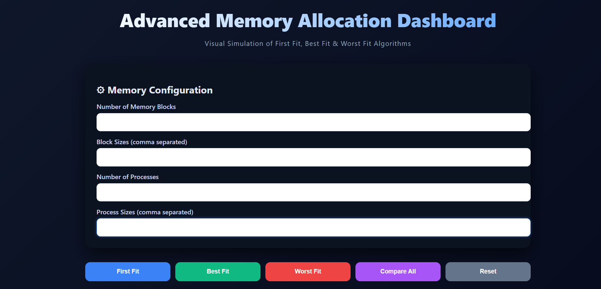
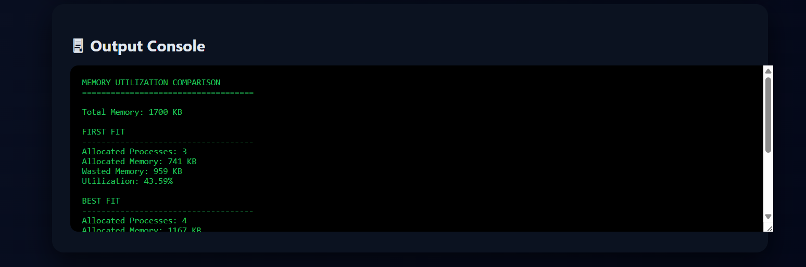
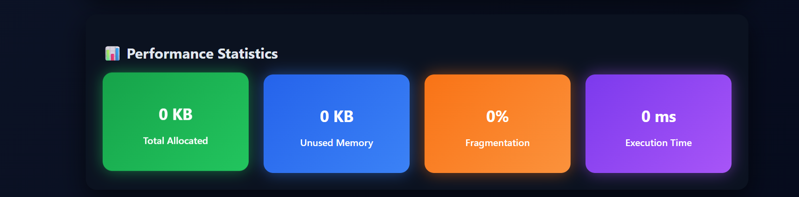
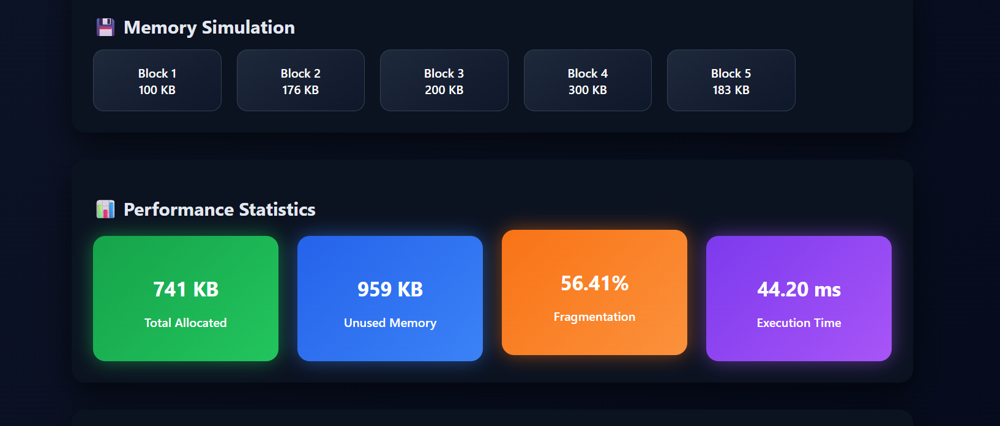
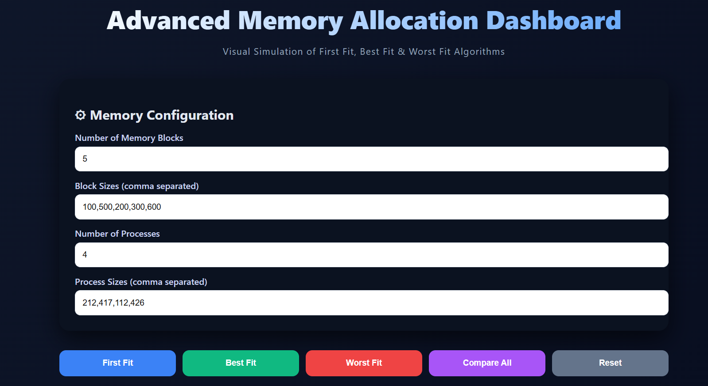

## 📸 Project Screenshots

### 🔹 Main Dashboard

### 🔹 Algorithm Execution Output

### 🔹 Memory Visualization

### 🔹 Performance Statistics

### 🔹 Memory Values Panel

### 🔹 Algorithm Comparison Graph
# Memory-Allocation-Visualizer
Developed a modular web-based simulation platform to demonstrate and compare contiguous memory allocation algorithms (First Fit, Best Fit, Worst Fit) with dynamic visualization and real-time statistical analysis using Flask and Chart.js.
